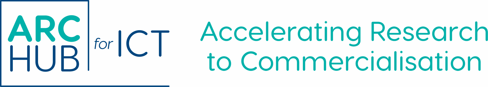

# ARC Hub for ICT

**An entrepreneurial pathway for Irish AI and ICT research.** The [Research Ireland ARC Hub for ICT](https://ict.archub.ie/) helps researchers turn novel ideas into practical products and services with commercial potential. The Hub connects research, entrepreneurial training, technical development and commercialisation support across Ireland.

[Explore the Hub](https://ict.archub.ie/) · [Browse projects](https://ict.archub.ie/arc-hub-for-ict-projects/) · [Meet the researchers](https://ict.archub.ie/people/)

## What we work on

Our projects span five research themes:

| Theme | What it explores |
| --- | --- |
| [Healthcare & Medical Applications](https://ict.archub.ie/arc-hub-for-ict-projects/?_themes_filter=healthcare-medical-applications) | Digital tools and AI for better care and medical outcomes. |
| [Digital Education & Online Communication](https://ict.archub.ie/arc-hub-for-ict-projects/?_themes_filter=digital-education-online-communication) | Learning, human–AI collaboration and online engagement. |
| [Digital Infrastructure](https://ict.archub.ie/arc-hub-for-ict-projects/?_themes_filter=digital-infrastructure) | Large-scale systems, networks and computing. |
| [Sustainable & Environmental Management](https://ict.archub.ie/arc-hub-for-ict-projects/?_themes_filter=sustainability-environmental-management) | Technology for resource use, environmental protection and climate action. |
| [Data Security, Privacy & Governance](https://ict.archub.ie/arc-hub-for-ict-projects/?_themes_filter=data-security-privacy-governance) | Trustworthy, secure and accountable use of data and AI. |

## Take the next step

- **Researchers:** [Explore the projects](https://ict.archub.ie/arc-hub-for-ict-projects/) and [meet the people behind them](https://ict.archub.ie/people/).
- **Potential applicants:** [Check the current call status and guidance](https://ict.archub.ie/call-for-proposals/) before preparing a proposal.
- **Partners and collaborators:** [Learn about the Hub](https://ict.archub.ie/about-us/).
- **Latest information:** Visit [News & Events](https://ict.archub.ie/news-events/) and the [Hub website](https://ict.archub.ie/) for current announcements.

The ARC Hub for ICT is co-funded by the Government of Ireland and the European Union through the ERDF Southern, Eastern & Midland Regional Programme 2021–2027.

## Project directory

<!-- projects:start -->
**All 62 projects**, alphabetically. Each link opens its full profile on [our website](https://ict.archub.ie/arc-hub-for-ict-projects/).

- **[6GOrch](https://ict.archub.ie/projects/6gorch/)** — Optimises how 6G networks allocate computing resources at the edge, so demanding services like autonomous vehicles run reliably on constrained hardware.
- **[ACROSS](https://ict.archub.ie/projects/ai-agents-for-localisation-operations/)** — A multi-agent AI platform that applies each company’s own terminology and style rules to machine translation, cutting costly human post-editing.
- **[Agri-Immanence](https://ict.archub.ie/projects/agri-immanence/)** — Agri-Immanence is an AI-enabled decision-support platform that combines greenhouse data, natural-language interaction, machine learning, and regional digital twins to deliver clear, explainable, and locally adaptive agronomic recommendations.
- **[AgriFuTech](https://ict.archub.ie/projects/agrifutech/)** — An AI genomic prediction engine that learns directly from complex, noisy datasets to deliver reliable trait predictions across crops and environments.
- **[AI-Go](https://ict.archub.ie/projects/ai-go/)** — A governance platform that maps every AI model a company runs, tracks performance and cost, and recommends where models can be consolidated.
- **[AI-Sprayer](https://ict.archub.ie/projects/ai-sprayer/)** — A chemical-free precision weeding, fertigation and irrigation platform for organic farms, using computer vision to target hot water at individual weeds.
- **[AIRIS](https://ict.archub.ie/projects/airis/)** — A RegTech platform for reporting serious AI incidents under Article 73 of the EU AI Act, connecting enterprise compliance systems directly to regulators.
- **[Alert](https://ict.archub.ie/projects/alert/)** — ALERT bridges this identification–resolution gap using Attribute-Enhanced Grammatical Evolution (GE), a machine-learning approach that automatically generates semantically correct, synthesis-ready HDL while maintaining functional equivalence and minimising regressions.
- **[AutoTwin-TSN](https://ict.archub.ie/projects/autotwin-tsn/)** — An AI-assisted digital twin that automates the design, configuration and validation of converged 5G and Time-Sensitive Networking for industrial automation.
- **[BIO-SMART](https://ict.archub.ie/projects/bio-smart/)** — This project will advance an Explainable AI (XAI) formulation platform from TRL 4 to TRL 6 to accelerate the discovery of high-performance biopolymer coatings for food and healthcare applications.
- **[Cardiac Rehab](https://ict.archub.ie/projects/cardiac-rehab/)** — A remote cardiac rehabilitation platform combining wearables and validated exercise protocols, reaching patients unlikely to attend centre-based programmes.
- **[Cipher AI](https://ict.archub.ie/projects/cipher-ai/)** — A game-based AI language learning platform combining speech, text and image generation to improve vocabulary, literacy and learner motivation.
- **[Climate Parametric Risk Solution (CPRS)](https://ict.archub.ie/projects/climate-parametric-risk-solution-cprs/)** — Parametric climate risk products for agriculture and renewable energy, helping farmers, lenders and operators manage weather-driven revenue volatility.
- **[Co-Decide](https://ict.archub.ie/projects/co-decide/)** — An AI-enabled platform that prepares people with serious illness for shared decision-making, turning advance care planning from paperwork into conversation.
- **[ColdChain](https://ict.archub.ie/projects/coldchain/)** — A low-cost, disposable RFID tag that signals remotely if frozen goods rise above zero, enabling continuous cold-chain monitoring across the supply chain.
- **[Dustec](https://ict.archub.ie/projects/dust-monitoring-solution-for-the-construction-sector/)** — An accurate, low-cost dust monitoring system built for small construction firms, making occupational exposure compliance affordable on site.
- **[EAComm](https://ict.archub.ie/projects/eacomm/)** — High-bandwidth optical neuromorphic AI chips that cut the electricity and water data centres consume to run rapidly growing AI workloads.
- **[EleVate](https://ict.archub.ie/projects/elevate/)** — An EV fleet battery platform using real-time vehicle data and AI to extend battery life, cut maintenance costs and improve fleet reliability.
- **[EURVISTA](https://ict.archub.ie/projects/eurvista/)** — An EU policy intelligence platform with a natural language interface, giving public affairs teams strategic insight into positions and stakeholder networks.
- **[FedHealthSecure](https://ict.archub.ie/projects/fed-health/)** — A federated learning framework that detects ransomware across healthcare networks without sharing patient data or relying on known signatures.
- **[FlowVis](https://ict.archub.ie/projects/flowvis/)** — Translates complex grid planning simulations into visuals non-technical decision-makers can act on, supporting multi-million euro infrastructure decisions.
- **[FLUX](https://ict.archub.ie/projects/flux/)** — Predicts the energy a computing workload will use before it runs, helping data centres cut costs, reduce emissions and meet EU reporting rules.
- **[FraudLens](https://ict.archub.ie/projects/fraudlens/)** — An AI platform for investigating cryptocurrency crime, linking transactions across wallets and consolidating victim reports for law enforcement.
- **[Happy Maths](https://ict.archub.ie/projects/happy-maths/)** — A game-based platform helping primary pupils practise maths while reducing maths anxiety, with adaptive gameplay and progress tools for teachers.
- **[IBSO](https://ict.archub.ie/projects/ibso/)** — The Irish Building Stock Observatory links building performance with social, economic and financial data so retrofit investment can be targeted with evidence.
- **[InvizCrypt](https://ict.archub.ie/projects/invizcrypt/)** — End-to-end encrypted document collaboration where keys never leave the browser, so no provider can read or be compelled to disclose your content.
- **[ISL Translate](https://ict.archub.ie/projects/isl-translate/)** — A machine translation system rendering English into Irish Sign Language through an avatar, extending language technology to a long-excluded community.
- **[KG Ark](https://ict.archub.ie/projects/kg-ark/)** — Creates privacy-preserving synthetic knowledge graphs that retain the relationships and semantic context of real data, unlocking restricted datasets for AI.
- **[LEAP-LA](https://ict.archub.ie/projects/leap-la/)** — An AI co-pilot for educators that turns multimodal learning data into conversational feedback, revealing learning gaps across whole cohorts.
- **[LocalLite](https://ict.archub.ie/projects/locallite/)** — Runs AI inference locally by optimising GPU memory, letting organisations deploy multi-agent systems without cloud API costs or data leaving the building.
- **[LUCARE](https://ict.archub.ie/projects/lucare/)** — Turns unstructured patient complaints and incident reports into structured, evidence-linked insights, so emerging safety risks surface earlier.
- **[Meta Expressions](https://ict.archub.ie/projects/meta-expressions/)** — A platform merging motion capture with motion synthesis, letting technical and non-technical users create expressive, believable animated characters.
- **[MIMOPilot](https://ict.archub.ie/projects/mimopilot/)** — A channel estimation technique that cuts signalling overhead in massive MIMO to a single pilot sample, improving spectral efficiency for 6G networks.
- **[Mocara](https://ict.archub.ie/projects/mocara/)** — A multilingual conversational platform explaining conditions and treatments using only regulator-approved content, adapted to each patient’s literacy level.
- **[MyNameIs](https://ict.archub.ie/projects/mynameis/)** — Verified, context-aware name pronunciation infrastructure, combining owner-recorded audio with linguistic validation for enterprise-scale use.
- **[NanoMind-GenAI](https://ict.archub.ie/projects/nanomind-genai/)** — NanoMind-GenAI is an AI-driven formulation intelligence platform that helps pharmaceutical companies, CDMOs, and R&D teams accelerate lipid nanoparticle (LNP) development for RNA therapeutics.
- **[OptiSIFT](https://ict.archub.ie/projects/optisift/)** — Certifies metal powder oxidation at the point of use in additive manufacturing, replacing destructive lab tests that take three to five days.
- **[PEDAL](https://ict.archub.ie/projects/pedal/)** — An AI pedagogical engine for language education that embeds task-based teaching and CEFR-aligned progression, not just AI-generated content.
- **[Presage](https://ict.archub.ie/projects/presage/)** — A no-code fault detection platform that lets maintenance engineers deploy predictive AI without data science expertise or large training datasets.
- **[PRIOR](https://ict.archub.ie/projects/prior/)** — Detects combustion drift, fouling and steam trap failure in SME thermal plants, recovering fuel losses of €14,000–€25,000 a year without costly sensors.
- **[PRISM](https://ict.archub.ie/projects/prism/)** — Relieves congestion on hospital wireless networks by enabling direct device-to-device communication, removing access points as a bottleneck.
- **[PrivacyGuard](https://ict.archub.ie/projects/privacyguard/)** — Keeps CCTV footage analysable while protecting identities, offering reversible privacy rather than permanent anonymisation or blanket encryption.
- **[Pro-Advance](https://ict.archub.ie/projects/pro-advance/)** — Takes ProACT, a validated digital platform for managing multimorbidity, from research prototype to a commercial product for community-based care.
- **[PromptMe](https://ict.archub.ie/projects/promptme/)** — A copilot for product definition, helping product managers turn scattered, ambiguous inputs into clear, consistent requirements before development starts.
- **[ProstheticAI](https://ict.archub.ie/projects/prostheticai/)** — An AI platform recommending personalised prosthesis configurations from patient data, improving socket fit, comfort and rehabilitation outcomes.
- **[Proxnote](https://ict.archub.ie/projects/proxnote/)** — Verifies authentic student authorship by capturing the writing process itself, rather than analysing finished text for AI-generated content.
- **[Pyrovista](https://ict.archub.ie/projects/pryovista/)** — Processes the 60 million-plus thermal data points a metal 3D print generates, predicting density and hardness without costly ex-situ testing.
- **[Pyrus\+\+](https://ict.archub.ie/projects/pyrus/)** — A no-code platform for building AI, machine learning and analytics pipelines by drag-and-drop, from school classrooms to research teams.
- **[RanControl](https://ict.archub.ie/projects/rancontrol/)** — Reinforcement learning xApps that let Open RAN networks adapt to new tasks without forgetting previous ones, supporting diverse 5G service demands.
- **[ReFocus](https://ict.archub.ie/projects/refocus/)** — The first hearing device to improve speech comprehension by shifting where sound appears to come from, developed for autistic listeners in noisy settings.
- **[ResilientChain](https://ict.archub.ie/projects/resilientchain/)** — This project will deliver ResilientChain, a cloud-based, AI-powered supply-chain resilience analytics platform combining combinatorial optimisation, simulation and machine learning.
- **[Road AI](https://ict.archub.ie/projects/road-ai/)** — Automatically assesses road surface condition from imagery using computer vision, replacing slow manual inspection of defects such as potholes.
- **[ScholarAI](https://ict.archub.ie/projects/scholarai/)** — An ethical AI research learning platform that makes the student research process visible, supporting academic integrity rather than policing outcomes.
- **[SelfHealth](https://ict.archub.ie/projects/selfhealth/)** — A privacy-respecting wearable platform turning everyday activity data into early warnings, supporting independent living with chronic conditions.
- **[Sign2me](https://ict.archub.ie/projects/sign2me/)** — A mobile app that interprets sign language into English in real time, adapting to the signer’s fluency and dialect across everyday interactions.
- **[SoccerIQ](https://ict.archub.ie/projects/soccer-iq/)** — Connects GPS and accelerometer data with tactical video analysis, automating insight that until now required labour-intensive manual coding.
- **[TEMPEST](https://ict.archub.ie/projects/tempest/)** — Protects UAV communications from jamming by fusing spectrum measurements, RF fingerprinting and terrain data to reroute flights in real time.
- **[TrueFrame](https://ict.archub.ie/projects/trueframe/)** — Predicts optimal AV1 encoder settings in a single pass, removing the repeated trial encodes that drive up cloud costs and energy use.
- **[VISION3D](https://ict.archub.ie/projects/vision3d/)** — Uses holographic volumetric 3D printing to produce next-generation intraocular lenses, improving visual quality after cataract surgery.
- **[VitalSignRadar](https://ict.archub.ie/projects/vitalsignradar/)** — Millimetre-wave radar that monitors breathing and micro-movements through clothing and barriers, with no wearable or physical contact required.
- **[Wingsense](https://ict.archub.ie/projects/wingsense/)** — Low-cost Doppler radar sensors that identify and count flying pollinators non-invasively, bringing biodiversity monitoring into environmental IoT networks.
- **[XRStream](https://ict.archub.ie/projects/xrstream/)** — Generates photorealistic 3D avatars from ordinary 2D images, enabling holographic telepresence without specialist capture hardware.
<!-- projects:end -->
